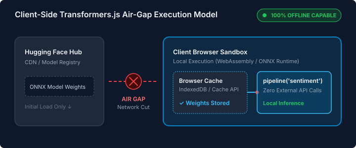

# transformers-js-airgap-demo
Interactive demonstration of 100% in-browser, air-gapped sentiment analysis using Transformers.js, WebAssembly, and local CacheStorage inspection.
# ✈️ In-Browser Sentiment Analysis (100% Client-Side Air-Gap Demo)

An interactive demonstration showing how to run transformer-based natural language processing models directly inside the web browser using **Transformers.js** (v3), **WebAssembly (WASM)**, and **ONNX Runtime Web**. 

Once the initial model payload is loaded, execution transitions to a **100% offline, air-gapped state** where no text or network requests leave the user's local device.

🔗 **Live Interactive Demo:** [ObservableHQ Notebook](https://observablehq.com/@mariodelgadosr/hello-hugging-face)

---

## 📐 Air-Gap Architecture Model

